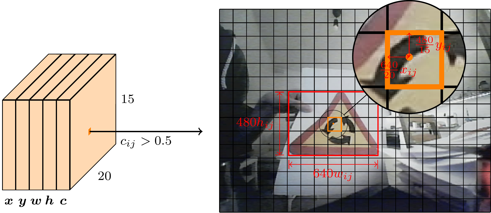

# DD2419 Detector Baseline
Simple detector baseline for DD2419 KTH course.

Should work with most recent Python and torch versions.

Tested with Python 2.7.17 + torch 1.4.0 & Python 3.7.5 + torch 1.7.1

## Overview
The image below shows the high-level architecture.


MobileNetV2 is a well established lightweight backbone designed for mobile applications. Inference can be performed on CPU while still achieving decent framerates. Additionally our task is not very complicated, hence it is expected that a smaller network such as this is sufficient. Pretrained backbones have been trained on large datasets (such as ImageNet classification) and can be reused for other tasks (such as detection, segmentation, etc.) by only replacing the head of the network. This significantly reduces training time and potentially improves generalization performance.

For an input resolution of 640x480 the network produces a 20x15x1280 feature tensor. This can roughly be interpreted as 1280 features for 20x15 image squares, although features do contain information from neighboring regions and even the whole image.

The head of our network is a 1x1 convolutional filter with 5 kernels, where the 5 output channels together encode the bounding box information (see below for why we use 5 channels). A 1x1 convolutional filter applied to the 20x15x1280 feature tensor will produce a 20x15x5 output tensor (you can imagine that for each 1280 feature vector `x` we apply a transformation `y = Ax + b` producing a 5-dimensional output vector `y`, where `A` and `b` are the weights of the 5 kernels).

See `Detector.__init__` and `Detector.forward` in `detector.py`.

## Bounding Box Parametrization
In general, neural networks are just a class of function approximators. To learn bounding boxes we need to find a bounding box parametrization that can be handled by the neural network. Here we choose to divide the image into 20x15 squares (based on MobileNetV2's output resolution for 640x480 input images). Each square predicts whether a bounding box center falls into it or not. Additionally we regress the relative offset of the center inside the cell, as well as the relative size of the bounding box (relative to the input image, i.e., width=1 corresponds to a bounding box width of 640). To summarize, the 20x15x5 output tensor of our network contains 5 numbers for each cell: the confidence that a bounding box center falls into this cell, the relative x offset, the relative y offset, the relative width and the relative height. See below for a visualization.



To learn the bounding boxes we need to produce the desired output of the network. For that we transform the ground truth bounding boxes (which were hand labeled) to the desired output format.

It is very important to make sure that the target generation (i.e., bounding box labels to target tensor) corresponds perfectly to the decoding (i.e., tensor to bounding boxes) of the network output. That is, decoding the target tensor should reproduce the bounding box labels.

Note that the current architecture is limited in that it can not represent multiple bounding boxes with the center falling into the same cell and it does not do any classification yet. Think about how to extend the network to also classify the bounding boxes. Not supporting multiple bounding boxes per cell should be no problem for the task at hand.

This is the most complicated part of the detector implementation. See `Detector.input_transform` and `Detector.decode_output`. Try to understand how it relates to the concepts described above.

## Training
Training the network will sample mini-batches of the dataset, and transform the inputs and labels to the desired input and output format, respectively. The network will then process the input data, producing an output tensor. To improve the network's performance we need a differentiable optimization metric (also called loss function). Here we simply use the mean-squared error between the optimal output tensor (generated from the labels) and the network output tensor. The choice of the loss function can have a large impact on the network's performance and different parts of the loss function might need to be weighed differently to achieve good performance. In the project you can experiment with other loss functions and weighings.

PyTorch will automatically compute the gradients of the loss function with respect to all the trainable weights (`loss.backward()`) and based on that do an optimization step (`optimizer.step()`). Note, that PyTorch automatically computes the gradients for most differentiable functions and provides a large selection of differentiable [loss functions](https://pytorch.org/docs/stable/nn.html#loss-functions) and [neural network layers](https://pytorch.org/docs/stable/nn.html#).

See `train.py` for the dataset loading and training loop.

You can also have a look at `utils.py` which contains functions to visualize bounding boxes, save and load models.

## Running and Monitoring the Training
To monitor the training you need an account on [wandb.ai](https://wandb.ai/home) (you can sign up using Google or GitHub). You will need to link your machine with your wandb account using your API key. The process is quite straightforward as you will be asked for an API key when executing the training script for the first time. The plugin will provide you with a link where to find the key.

To run the training you need the traffic sign dataset in the folder `./dd2419_coco` (see Canvas for dataset links). 

To run the training on CPU execute
```shell
python train.py --cpu
```
for GPU execute
```shell
python train.py --gpu
```
